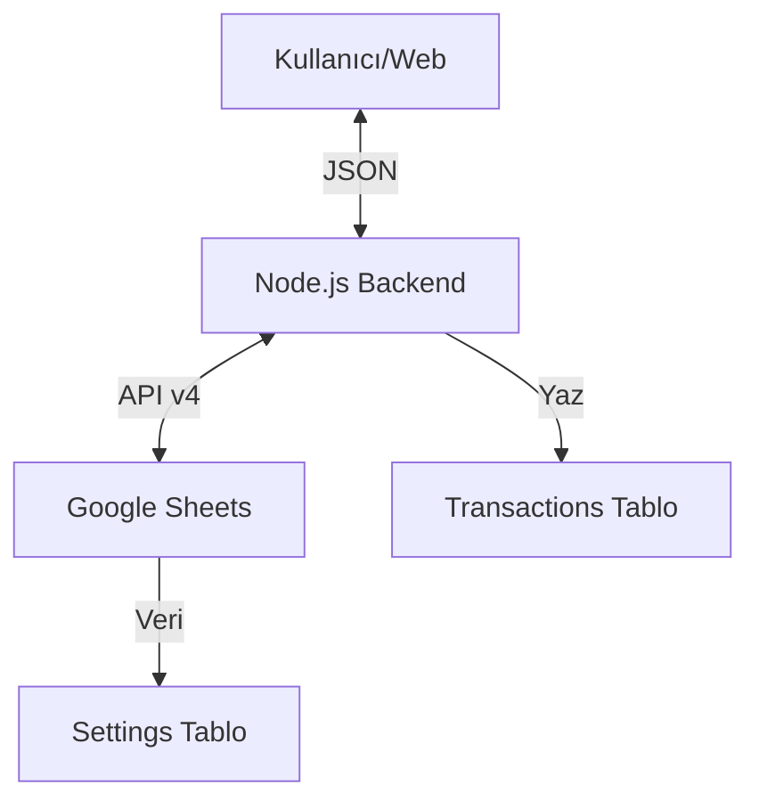

# Sistem Desenleri

## Sistem Mimarisi
Uygulama, "Thin Client" (İnce İstemci) ve "API Proxy" mimarisini kullanır.

## Temel Teknik Kararlar
1.  **Backend Proxy**: Google Cloud Service Account anahtarını (credentials.json) tarayıcıya gömmek yerine sunucuda tutarak güvenlik sağlandı.
2.  **Stateless API**: Sunucu herhangi bir kullanıcı verisi tutmaz, her istekte Google Sheets'ten güncel veriyi çeker veya yazar.
3.  **Docker**: Dağıtım kolaylığı için uygulama ve bağımlılıkları tek bir imajda paketlendi.

## Bileşen İlişkileri
- **Frontend (public/index.html)**: Sadece sunum katmanıdır. Mantık yönetmez, veriyi sunucudan ister.
- **Backend (server.js)**: İş mantığı (tarih formatlama, veri doğrulama) ve veri erişim katmanıdır.
